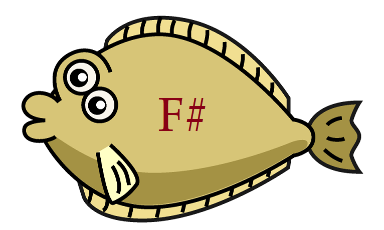

# Flounder

An attempt at a Chess Engine in F#. This was initially just a conversion from the excellent [StockNemo](https://github.com/TheBlackPlague/StockNemo).

The code was then been significantly re-factored to be more in line with standard F# coding.

The code has now been completely revisited with removal of such features as Classes and Inheritance. Instead extensive use is made of F# Record Types and Modules.

Furthermore, the NNUE has been replaced with that from the brilliant [Berserk Engine](https://github.com/jhonnold/berserk).

The result seems a pretty strong engine.

## Features

### Included

The engine includes:

- Null Move Pruning
- Late Move Pruning
- Reverse Futility Pruning
- Three-fold Repetition Pruning
- Mate Distance Pruning
- Material Draw Pruning
- Check Extension
- Quiescence Search with SEE Pruning
- History Table
- Killer Move Table
- Search Effort Table
- Move Search Stack
- Reduced Time Move
- MVV-LVA Table

### Not Included

The following features were not included as they were tested and seemed to give no benefit:

- Futility Pruning
- Late Move Reduction

